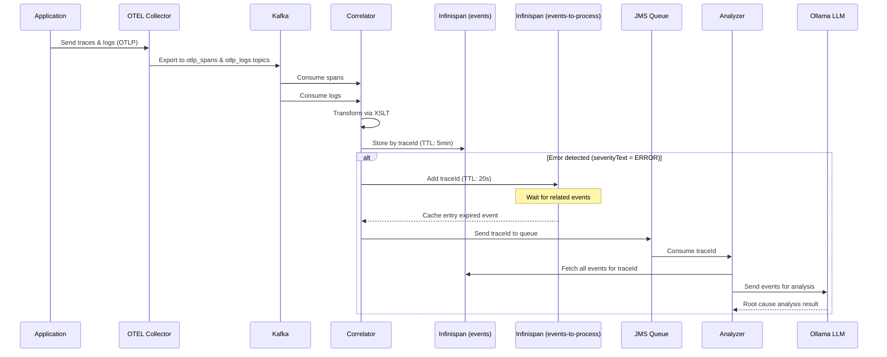

# Smart Log Analyzer

An intelligent observability system that correlates OpenTelemetry logs and traces, then uses LLM for automated root cause analysis.

## Architecture



## Components

### Correlator

The correlator is the central event processing component:

- Consumes OTEL logs from `otlp_logs` Kafka topic
- Consumes OTEL traces from `otlp_spans` Kafka topic
- Transforms complex OTEL format to simplified JSON via XSLT
- Correlates all events by traceId in Infinispan `events` cache (TTL: 5min)
- Uses `events-to-process` cache for deferred error analysis:
  - When an ERROR log is detected, adds the traceId to this cache with a 20s TTL
  - Listens for cache expiration events to trigger analysis
  - This delay ensures all related spans and logs are collected before analysis
- Sends expired traceIds to JMS queue for the Analyzer

### Analyzer

The analyzer performs intelligent root cause analysis:

- Listens on JMS `error-logs` queue for traceIds from the Correlator
- Retrieves full trace context from Infinispan `events` cache
- Sends events to Ollama LLM (granite4:3b) for intelligent analysis
- Outputs analysis results to logs

### Log Generator

A synthetic log generator for demonstration purposes that shows how to add OpenTelemetry observability to Apache Camel applications. It simulates order processing with intentional errors (30% failure rate).

**Adding OpenTelemetry to your Camel application requires:**

1. **opentelemetry-javaagent.jar** - The OTEL Java agent for automatic instrumentation. Download from [OpenTelemetry releases](https://github.com/open-telemetry/opentelemetry-java-instrumentation/releases).

2. **agent.properties** - Configures the OTEL agent:
   ```properties
   otel.service.name=log-generator
   otel.traces.exporter=otlp
   otel.logs.exporter=otlp
   otel.metrics.exporter=none
   ```

3. **application-dev.properties** - Enables Camel OpenTelemetry integration:
   ```properties
   camel.opentelemetry2.enabled = true
   camel.jbang.dependencies=org.apache.camel:camel-opentelemetry2
   ```

Run with the javaagent flag pointing to the agent jar and its configuration file. With this setup, Camel will automatically expose custom traces for route executions and exchanges.

## Prerequisites

- Docker & Docker Compose
- [JBang](https://www.jbang.dev/download/)
- [Ollama](https://ollama.ai/) with `granite4:3b` model:
  ```bash
  ollama pull granite4:3b
  ```

## Running the Application

### 1. Start Infrastructure

```bash
cd containers
docker-compose up
```

### 2. Start Correlator

```bash
cd correlator
jbang -Dcamel.jbang.version=4.17.0 camel@apache/camel run \
  traces-mapper.camel.yaml \
  logs-mapper.camel.yaml \
  infinispan.camel.yaml \
  kaoto-datamapper-4a94acc3.xsl \
  kaoto-datamapper-8f5bb2dd.xsl
```

### 3. Start Analyzer

```bash
cd analyzer
jbang -Dcamel.jbang.version=4.17.0 camel@apache/camel run error-analyzer.camel.yaml
```

### 4. Start Log Generator

```bash
cd log-generator
jbang --javaagent=./opentelemetry-javaagent.jar \
  -Dotel.javaagent.configuration-file=./agent.properties \
  -Dcamel.jbang.version=4.17.0 \
  camel@apache/camel run log-generator.camel.yaml
```

## Infrastructure Services

| Service | Port | Purpose |
|---------|------|---------|
| Kafka | 9092 | Message broker for OTEL data |
| Infinispan | 11222 | Event cache (admin:password) |
| OTEL Collector | 4317, 4318 | Telemetry receiver (gRPC, HTTP) |
| ActiveMQ Artemis | 61616, 8161 | JMS broker (artemis:artemis) |
